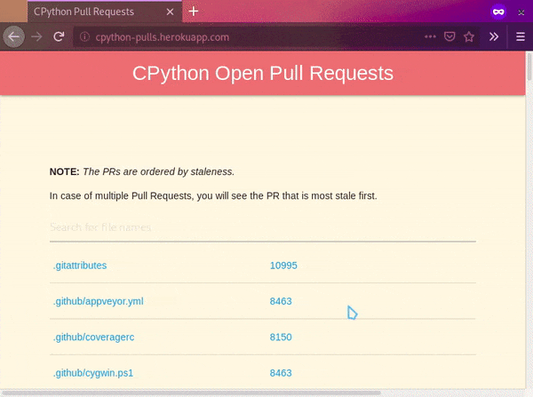

# pulls
Get Files for all open Pull Requests

Basic code to query GitHub and get the open PRs by file name.

If you want to look at the code that fetches and processes the data:
`pull_request_files.py` creates an object of PullRequests class. The object contains the raw data returned
from the GraphQL query along with a variable `files` containing dictionary with file names as key and PR number
as the value. There's also a titles variable that is a dictionary storing PR title for each PR number.

`process_pulls.py` Contains functions used by pull_request_files to process the GraphQL data returned by GitHub. 

`views.py` Aside from the flask code, it also contains code for APScheduler which updates the `files` variable in the background
at specific intervals.

You need to create a personal access token at settings/Developer settings of your GitHub account. The token doesn't need to have any
particular scope. The default public access works fine.

:-)
